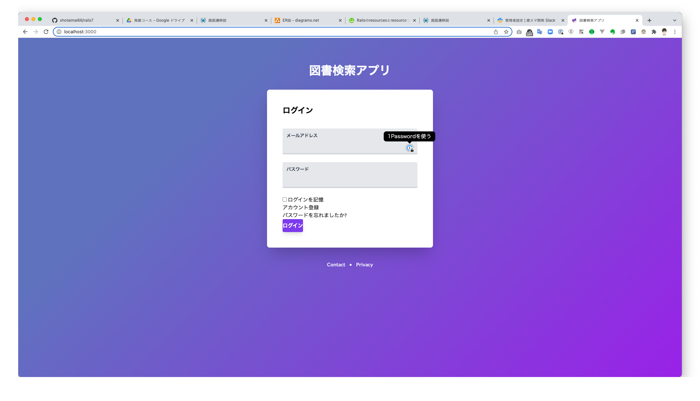

# README
## 🌟リポジトリの設定
- このリポジトリをコピーして別のリポジトリを作成する方法
  - https://github.com/shotaimai66/readme-develop/blob/main/%E3%83%AA%E3%83%9D%E3%82%B8%E3%83%88%E3%83%AA%E3%81%AE%E3%82%B3%E3%83%94%E3%83%BC%E6%96%B9%E6%B3%95.md

- mainブランチの保護設定とレビュー必須設定方法
  - https://github.com/shotaimai66/readme-develop/blob/main/%E3%83%96%E3%83%A9%E3%83%B3%E3%83%81%E3%81%AE%E4%BF%9D%E8%AD%B7%E8%A8%AD%E5%AE%9A%E3%81%A8%E3%83%AC%E3%83%93%E3%83%A5%E3%83%BC%E5%BF%85%E9%A0%88%E8%A8%AD%E5%AE%9A.md

## 環境セット
- ruby 3.1.1
- rails 7.0.2.2
- docker
- mysql 8.0
## 環境構築
- イメージのビルド
```
docker-compose build
```
- コンテナ起動
```
docker-compose up
```
- db(mysql)の作成とテストデータ投入
```
docker-compose run --rm app rails db:setup
```
- ブラウザを確認する(以下のようなログイン画面が表示されたらOK！)
```
http://localhost:3000
```



## 開発コマンド
- railsでbinding.irbを使う時などは以下のコマンドで起動するのが良い（いつもこれで起動でも良さそう）
```
bin/debug
```
- 全体テスト実行
```
bin/test
```
- appコンテナ内でコマンド実行(`docker-compose run --rm app`と同義)
```
bin/docker/bundle/exec
```
- railsコマンド
```
bin/docker/bundle/exec rails db:migrate
```
- bundle install
```
bin/docker/bundle/exec bundle install
```
- 特定のファイルをテスト実行
```
bin/docker/bundle/exec rspec specファイルの相対path
```
- 構文チェック
```
bin/docker/bundle/exec rubocop
```
- erd生成
```
bin/docker/bundle/exec erd
```
